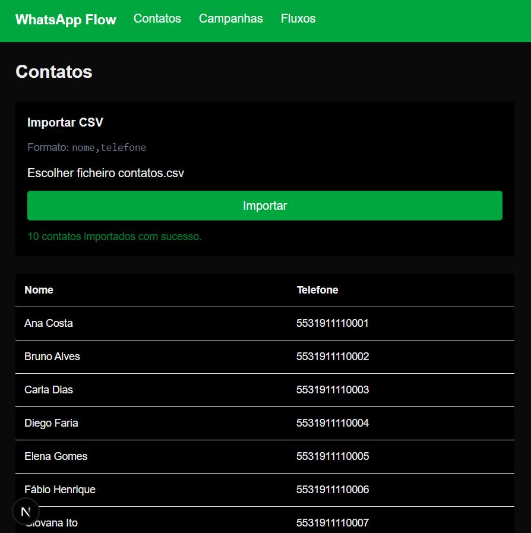
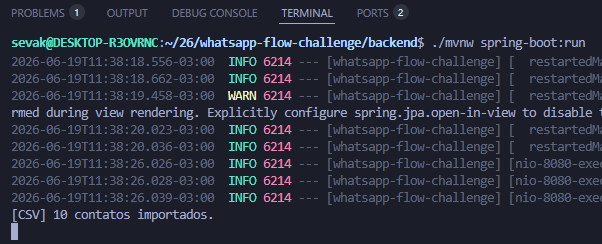
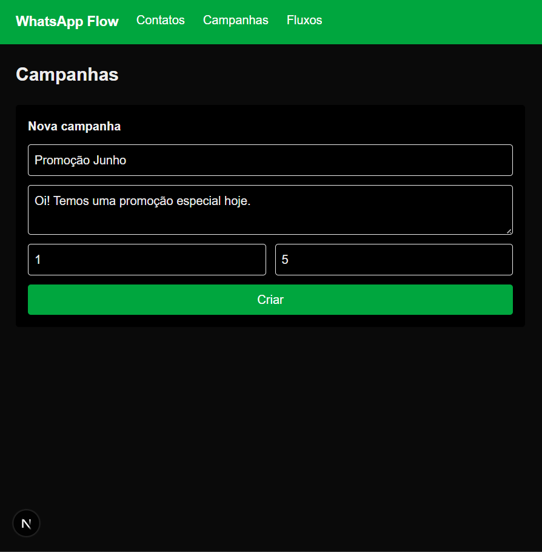
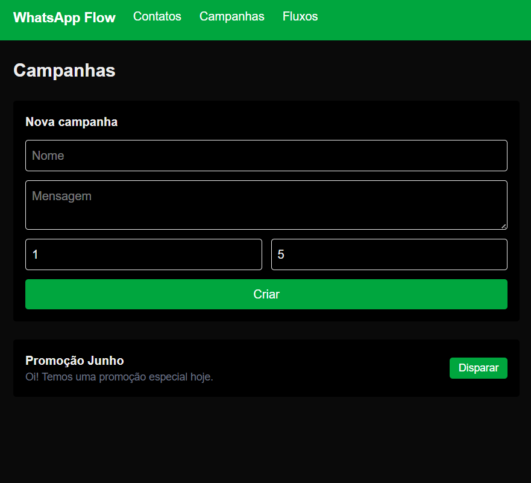
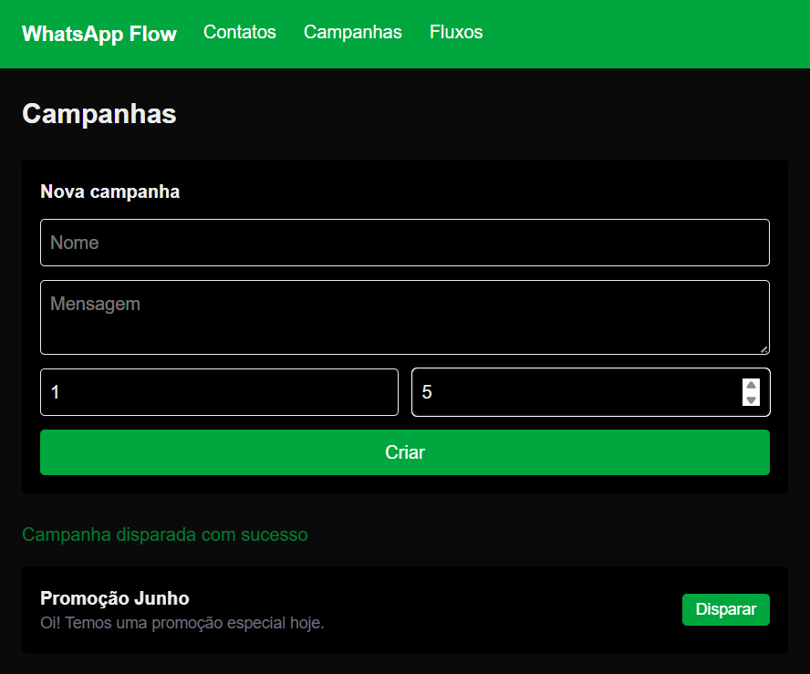
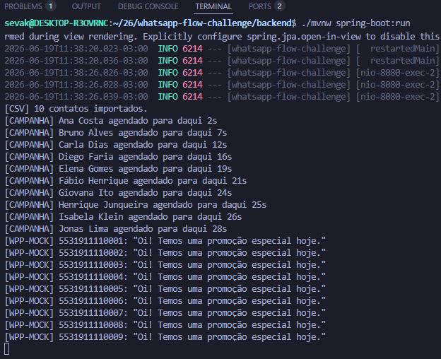
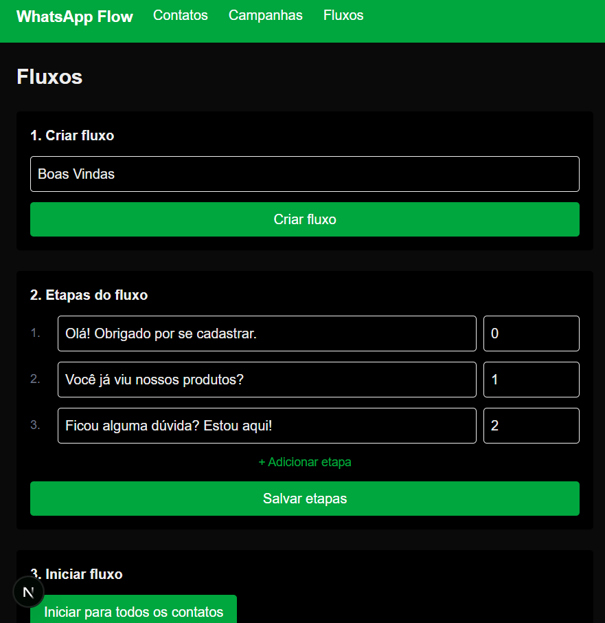
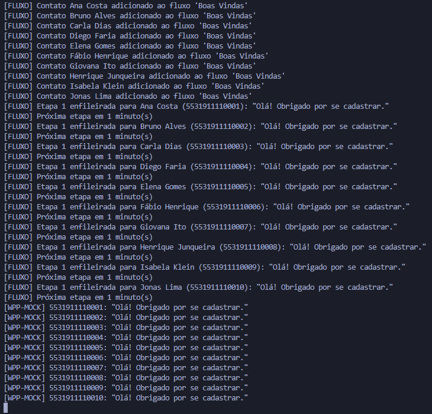
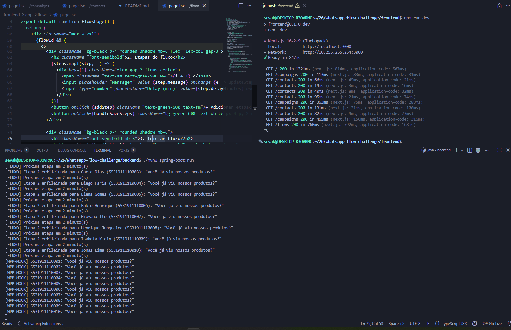

# WhatsApp Flow Challenge

Sistema de disparo automático de mensagens via WhatsApp com suporte a campanhas e fluxos sequenciais.

## Tecnologias

- **Backend:** Java 21 + Spring Boot 4.1
- **Banco de dados:** PostgreSQL 17 (Docker)
- **Migrations:** Flyway
- **Agendamento:** Spring Scheduler
- **Frontend:** Next.js 16 + Tailwind CSS
- **Envio:** WPPConnect (mock por padrão)

## Como rodar

### Pré-requisitos

- Java 21
- Docker
- Node.js 18+

### 1. Banco de dados

```bash
cd backend
docker compose up -d
```

### 2. Backend

```bash
cd backend
./mvnw spring-boot:run
```

Sobe na porta `8080`.

### 3. Frontend

```bash
cd frontend
npm install
npm run dev
```

Sobe na porta `3000`.

---

## Funcionalidades

### Contatos

Importação de contatos via arquivo CSV com colunas `nome,telefone`. Após a importação, os contatos ficam listados na tela.



O backend confirma a importação no log:



---

### Campanhas

Criação de campanha com mensagem e delay mínimo/máximo em segundos. Ao disparar, cada contato recebe a mensagem com delay acumulado sequencial — nenhum envio ocorre direto no controller.







O log mostra cada contato agendado individualmente e os envios saindo um a um:



---

### Fluxos

Criação de fluxo com etapas sequenciais. Cada etapa tem uma mensagem e um delay em minutos. Ao iniciar, todos os contatos entram no fluxo e cada um executa as etapas de forma independente.



O log mostra cada etapa sendo enfileirada e enviada no tempo certo:



---

### Persistência e execução independente do navegador

O sistema continua funcionando mesmo com o frontend fechado. O scheduler roda continuamente no backend, verifica mensagens pendentes no banco e executa os envios automaticamente.

Na imagem abaixo, o frontend está fechado e o fluxo continua sendo processado normalmente:



Isso é possível porque toda execução é persistida no banco — a tabela `send_queue` guarda cada mensagem pendente com seu horário agendado, e a tabela `flow_executions` guarda o estado de cada contato no fluxo. Mesmo que o servidor reinicie, o scheduler retoma de onde parou.

---

## Arquitetura
Controller → Service → send_queue (banco) → QueueScheduler → WppConnectService

O envio nunca ocorre direto no controller. Tudo passa pela fila persistida no banco, processada pelo scheduler a cada 1 segundo.

O fluxo funciona de forma similar com `flow_executions` e `FlowScheduler`.

---

## Banco de dados

| Tabela | Descrição |
|--------|-----------|
| `contacts` | Contatos importados |
| `campaigns` | Campanhas de disparo |
| `send_queue` | Fila de mensagens pendentes |
| `flows` | Fluxos de mensagens |
| `flow_steps` | Etapas de cada fluxo |
| `flow_executions` | Execução individual por contato |

---

## WPPConnect

Por padrão o sistema roda em modo mock — os envios são logados no console.

Para ativar o envio real, configure o `application.yaml`:

```yaml
wppconnect:
  url: http://localhost:21465
  token: seu-token
  session: minha-sessao
```